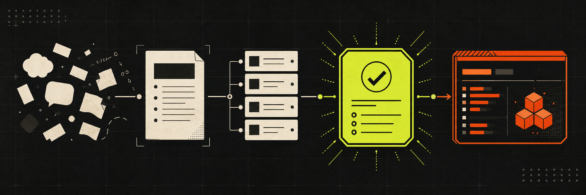

<p align="center">
  
</p>

<div align="center">

# Matt Skills with To-Goal

**把模糊想法编译成可验证、可交接、可在新会话直接执行的 Goal**

让规划线程专注于把事情想清楚，让执行线程专注于把事情做完。

[](https://github.com/mattpocock/skills)
[](#安装)
[](LICENSE)

`grill → spec → tickets → goal → fresh session → review`

[**▶ 在线故事版：别让一个线程从需求聊到代码写完**](https://verifiable-goal-weekly-share-public.pages.dev)

</div>

## 它解决什么问题

AI coding 任务常常从需求讨论一路聊到代码实现。线程越长，上下文越容易膨胀、压缩和变慢；但直接开新线程，又担心缺少需求背景和已经确认的决策。

这套技能把工作拆成两类线程，并用仓库里的持久化证据连接它们：

| 常见困境 | 这套流程的处理方式 |
|---|---|
| 方案讨论和代码实现挤在一个长线程里 | 用规划线程沉淀 spec 和 tickets，用新线程执行单个 goal |
| 新线程不知道之前聊过什么 | ticket、评论、仓库状态和 goal 共同携带执行所需上下文 |
| Agent 开工前又把需求重新问一遍 | `to-goal` 以 compiled-handoff 模式读取既有证据，不重复规划访谈 |
| 不同任务都使用同一档模型和推理强度 | goal 按风险推荐 Lightweight / Standard / Advanced 与推理强度 |
| “做完了”依赖人的主观判断 | 每个 goal 都带可观察、可检查的完成标准 |

> **Goal 不是聊天摘要，而是一份执行契约。** 它记录当前状态、执行顺序、完成标准、约束和验证方式，让新的实现线程能够直接开始工作。

## 30 秒看懂主流程


普通任务默认一次只编译一个当前可执行的 frontier ticket。超大任务先用 `wayfinder` 画清调查与决策路线，再回到主流程。

## 三分钟开始

### 1. 安装

```bash
npx skills@latest add tt-a1i/matt-skills-with-to-goal
```

也可以只把需要的子目录从 [`skills/`](skills/) 复制到你的 agent skills 目录，例如 `~/.agents_skills/`。

### 2. 初始化项目

每个项目首次使用时运行：

```text
/setup-matt-pocock-skills
```

它会确认三件事：issue tracker 在哪里、triage 标签如何映射、domain docs 如何组织。之后其他工程技能会读取这些约定。

### 3. 走一遍最短链路

```text
/grill-me
/to-spec
/to-tickets
/to-goal
```

把 `/to-goal` 输出的完整 goal 粘贴到一个新会话，让它直接实现。完成后按 goal 记录的 fixed point 运行 `/code-review`。

## `to-goal` 增加了什么

Matt 原版流程擅长把需求烤清楚、写成 spec、拆成 tickets。本仓库在 `to-tickets` 之后增加 `to-goal`，把“已经规划好的任务”进一步编译成“新线程可以直接执行的契约”。

```text
Goal
├── Current state       分支、HEAD、已完成证据、已知缺口
├── Execution order     最短的依赖顺序
├── Completion criteria 可逐条判断 done / not done 的标准
├── Constraints         范围、权限、脏文件与外部操作边界
└── Context             spec、ticket、设计文档和验证入口
```

`goal-crafter` 有两种模式：

- **Standalone**：用户直接要求编写 goal，先澄清任务、位置、完成标准、约束和执行环境。
- **Compiled handoff**：由 `to-goal` 调用，直接读取已批准的 spec、ticket、评论和仓库状态，不重新访谈。

如果上游材料缺少关键产品决策，compiled-handoff 模式会指出 source 尚未 agent-ready，而不是在实现线程里重新开始需求讨论。

## 如何选择入口

| 你的情况 | 从这里开始 |
|---|---|
| 不确定该用哪个 skill | `/ask-matt` |
| 有一个想法，需要把需求问清楚 | `/grill-me` |
| 想边聊边沉淀文档 | `/grill-with-docs` |
| 工作很大，连路线都还不清楚 | `/wayfinder` |
| 已有共识，需要形成 spec | `/to-spec` |
| 已有 spec，需要拆成可执行切片 | `/to-tickets` |
| 已有 agent-ready ticket，要开新线程实现 | `/to-goal` |
| 外部 issue / PR 需要评估和分流 | `/triage` |
| 正在定位复杂 bug | `/diagnosing-bugs` |
| 已完成一段实现，需要双轴评审 | `/code-review` |

## 技能地图

### 规划与交接

| Skill | 作用 |
|---|---|
| `ask-matt` | 按当前情况选择入口 |
| `grill-me` / `grilling` | 通过逐问逐答收敛计划和设计 |
| `grill-with-docs` | 访谈过程中同步沉淀文档 |
| `wayfinder` | 为超大任务建立共享调查与决策地图 |
| `to-spec` | 当前对话 → agent-ready spec |
| `to-tickets` | spec → 带依赖关系的 tracer-bullet tickets |
| `to-goal` | frontier ticket → 可粘贴的执行 goal |
| `goal-crafter` | 负责 goal 的可验证性与 harness 格式 |
| `handoff` | 仅在关键上下文尚未沉淀到持久化载体时交接会话 |

### 实现与质量

| Skill | 作用 |
|---|---|
| `implement` | 按 spec、ticket 或 goal 实现；goal 存在时直接执行契约 |
| `tdd` | 在预先确认的 seam 上进行测试驱动实现 |
| `code-review` | Standards + Spec 双轴评审，支持已提交分支和 WIP worktree |
| `prototype` | 用一次性逻辑或 UI 原型回答设计问题 |
| `research` | 使用高可信来源完成技术调研 |
| `triage` | 将外来 issue / PR 推进到明确状态 |

### 工程理解

| Skill | 作用 |
|---|---|
| `codebase-design` | 讨论和比较代码结构设计 |
| `diagnosing-bugs` | 系统化定位复杂故障 |
| `domain-modeling` | 维护领域语言、CONTEXT 和 ADR |
| `improve-codebase-architecture` | 识别并推进架构深化机会 |
| `resolving-merge-conflicts` | 处理合并冲突并保护双方意图 |

## 设计边界

- 默认一个 goal 只覆盖一个 frontier ticket；`--all` 仅用于明确要求的跨 ticket 持久化执行。
- `to-goal` 只读 spec、tracker 和仓库证据，不实现、不改 issue 状态、不创建分支。
- goal 不会默认授权 push、PR、merge、关闭 issue 或修改 tracker。
- 验证强度跟随任务风险；低风险改动不机械要求全量测试，高风险逻辑必须覆盖对应验证面。
- `handoff` 不是每次切线程的必选步骤。只要上下文已进入 spec、ticket、评论和代码，新线程可以直接重建理解。

## 来源与许可

本仓库基于 [mattpocock/skills](https://github.com/mattpocock/skills) **v1.1**，并增加 `to-goal`、`goal-crafter` 以及 goal handoff / WIP review 相关适配。

- Matt 原版技能：© [Matt Pocock](https://github.com/mattpocock/skills)，MIT
- 本仓库扩展与适配：MIT
- 完整许可见 [`LICENSE`](LICENSE)

### 与上游命名的对应关系

- `to-prd` → `to-spec`
- `to-issues` → `to-tickets`
- 新增 `wayfinder`
- 在 `to-tickets` 之后增加 `to-goal`
