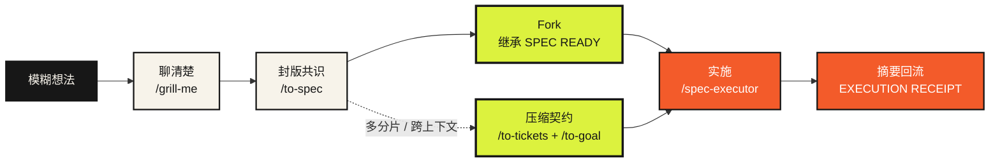

<p align="center">
  
</p>

<div align="center">

# Matt Skills with To-Goal

**把需求留在规划线程，把实现放进继承 Spec 的执行线程**

让规划线程专注于把事情想清楚，让执行线程专注于把事情做完。

[](https://github.com/mattpocock/skills)
[](#安装)
[](LICENSE)

`grill → spec ready → fork → execute → receipt`

[**▶ 在线故事版：别让一个线程从需求聊到代码写完**](https://verifiable-goal-weekly-share-public.pages.dev)

</div>

## 它解决什么问题

AI coding 任务常常从需求讨论一路聊到代码实现。线程越长，上下文越容易膨胀、压缩和变慢；但直接开新线程，又担心缺少需求背景和已经确认的决策。

这套技能把工作拆成两类线程，并用仓库里的持久化证据连接它们：

| 常见困境 | 这套流程的处理方式 |
|---|---|
| 方案讨论和代码实现挤在一个长线程里 | 规划线程停在 `SPEC READY`，fork 线程承担代码和测试日志 |
| Fork 后又重新分析和改写一遍 Goal | `spec-executor` 直接执行继承的最终 Spec，并回传结构化 receipt |
| 当前上下文太脏、无法可靠继承 | `to-goal` 把 ticket 和仓库证据压成干净的执行契约 |
| 不同任务都使用同一档模型和推理强度 | goal 按风险推荐 Lightweight / Standard / Advanced 与推理强度 |
| “做完了”依赖人的主观判断 | Goal 带完成标准，executor 回传逐项证据和外部操作状态 |

> **Fork 负责隔离后续上下文，Goal 负责压缩已有上下文。** 连续开发优先 fork；跨人、跨天、并行或上下文混乱时使用 `to-goal`。

## 30 秒看懂主流程


```mermaid
flowchart LR
    idea["模糊想法"] --> grill["聊清楚<br/>/grill-me"]
    grill --> spec["封版共识<br/>/to-spec"]
    spec --> fork["Fork<br/>继承 SPEC READY"]
    fork --> execute["实施<br/>/spec-executor"]
    execute --> receipt["摘要回流<br/>EXECUTION RECEIPT"]
    spec -. "多分片 / 跨上下文" .-> goal["压缩契约<br/>/to-tickets + /to-goal"]
    goal --> execute

    classDef source fill:#171717,color:#F7F3EA,stroke:#171717,stroke-width:2px;
    classDef plan fill:#F7F3EA,color:#171717,stroke:#171717,stroke-width:2px;
    classDef contract fill:#DCF23E,color:#171717,stroke:#171717,stroke-width:3px;
    classDef action fill:#F35B2A,color:#FFFFFF,stroke:#171717,stroke-width:2px;

    class idea source;
    class grill,spec plan;
    class fork,goal contract;
    class execute,receipt action;
```

普通连续开发默认从最终 `SPEC READY` 处 fork。多分片、并行、延迟执行或上下文混乱时，再用 `to-tickets` / `to-goal` 建立可独立执行的合同。

## 三分钟开始

### 1. 安装

```bash
npx skills@latest add tt-a1i/matt-skills-with-to-goal
```

也可以只把需要的子目录从 [`skills/`](skills/) 复制到你的 agent skills 目录，例如 `~/.agents_skills/`。

### 2. 初始化项目

每个项目首次使用时运行：

```text
/setup-matt-pocock-skills
```

它会确认三件事：issue tracker 在哪里、triage 标签如何映射、domain docs 如何组织。之后其他工程技能会读取这些约定。

### 3. 走一遍最短链路

```text
/grill-me
/to-spec
从 SPEC READY 处 fork
/spec-executor
```

执行线程完成后，把 `SPEC EXECUTION RECEIPT` 复制回规划线程。若 Spec 无法在一个执行会话完成，则改走 `/to-tickets` → `/to-goal`。

## Fork 与 `to-goal` 如何分工

- **Fork + `spec-executor`**：当前线程已经把需求谈清楚，Spec 能在一个执行会话完成；复用继承上下文，避免重复查 Spec 和重写 Goal。
- **`to-goal`**：需要跨人、跨天、并行、独立 Agent，或者当前历史过长、存在多版冲突；用压缩后的执行合同换取干净上下文。
- **同线程 `/implement`**：小而明确、不值得建立持久 Spec 的改动。

## `to-goal` 增加了什么

Matt 原版流程擅长把需求烤清楚、写成 spec、拆成 tickets。本仓库在 `to-tickets` 之后增加 `to-goal`，把“已经规划好的任务”进一步编译成“新线程可以直接执行的契约”。

```text
Goal
├── Current state       分支、HEAD、已完成证据、已知缺口
├── Execution order     最短的依赖顺序
├── Completion criteria 可逐条判断 done / not done 的标准
├── Constraints         范围、权限、脏文件与外部操作边界
└── Context             spec、ticket、设计文档和验证入口
```

`goal-crafter` 有两种模式：

- **Standalone**：用户直接要求编写 goal，先澄清任务、位置、完成标准、约束和执行环境。
- **Compiled handoff**：由 `to-goal` 调用，直接读取已批准的 spec、ticket、评论和仓库状态，不重新访谈。

如果上游材料缺少关键产品决策，compiled-handoff 模式会指出 source 尚未 agent-ready，而不是在实现线程里重新开始需求讨论。

## 如何选择入口

| 你的情况 | 从这里开始 |
|---|---|
| 不确定该用哪个 skill | `/ask-matt` |
| 有一个想法，需要把需求问清楚 | `/grill-me` |
| 想边聊边沉淀文档 | `/grill-with-docs` |
| 工作很大，连路线都还不清楚 | `/wayfinder` |
| 已有共识，需要形成 spec | `/to-spec` |
| 已有 spec，需要拆成可执行切片 | `/to-tickets` |
| 已有 agent-ready ticket，要开新线程实现 | `/to-goal` |
| 关键在别人脑子里，需要问卷收集 | `/to-questionnaire` |
| 外部 issue / PR 需要评估和分流 | `/triage` |
| 正在定位复杂 bug | `/diagnosing-bugs` |
| 已完成一段实现，需要双轴评审 | `/code-review` |

## 技能地图

### 规划与交接

| Skill | 作用 |
|---|---|
| `ask-matt` | 按当前情况选择入口 |
| `grill-me` / `grilling` | 按轮次烤决策树 frontier，一轮多问直到共识 |
| `grill-with-docs` | 访谈过程中同步沉淀文档 |
| `wayfinder` | 为超大任务建立共享调查与决策地图 |
| `to-spec` | 当前对话 → agent-ready spec |
| `to-tickets` | spec → 带依赖关系的 tracer-bullet tickets |
| `to-goal` | frontier ticket → 可粘贴的执行 goal |
| `goal-crafter` | 负责 goal 的可验证性与 harness 格式 |
| `to-questionnaire` | 把答不上的决策编成问卷交给他人填写 |
| `handoff` | 仅在关键上下文尚未沉淀到持久化载体时交接会话 |

### 实现与质量

| Skill | 作用 |
|---|---|
| `implement` | 按 spec 或 tickets 实现，驱动 `/tdd`，收尾跑 `/code-review` |
| `spec-executor` | 在 fork 线程锁定 `SPEC READY`、权限和 fixed point，完成实现并输出 receipt |
| `tdd` | 在预先确认的 seam 上进行测试驱动实现 |
| `code-review` | Standards + Spec 双轴评审 |
| `prototype` | 逻辑用可分享 HTML / UI 用变体探索，并保留为 primary source |
| `research` | 使用高可信来源完成技术调研 |
| `triage` | 将外来 issue / PR 推进到明确状态 |

### 工程理解与其他

| Skill | 作用 |
|---|---|
| `codebase-design` | 讨论和比较代码结构设计 |
| `diagnosing-bugs` | 系统化定位复杂故障 |
| `domain-modeling` | 维护领域语言、CONTEXT 和 ADR |
| `improve-codebase-architecture` | 识别并推进架构深化机会 |
| `resolving-merge-conflicts` | 处理合并冲突并保护双方意图 |
| `teach` | 多会话教学，目录作为有状态学习空间 |
| `writing-for-agents` | 编写给 agent 消费的文档（skills、AGENTS.md 等） |

## 设计边界

- 默认一个 goal 只覆盖一个 frontier ticket；`--all` 仅用于明确要求的跨 ticket 持久化执行。
- `spec-executor` 只执行一个已封版、单会话可完成的 Spec；需求未定或体量溢出时停止并重新路由。
- `to-goal` 只读 spec、tracker 和仓库证据，不实现、不改 issue 状态、不创建分支。
- Fork 只隔离对话，不隔离文件系统；并行实现仍需独立 worktree、分支和文件所有权。
- goal 不会默认授权 push、PR、merge、关闭 issue 或修改 tracker。
- 验证强度跟随任务风险；低风险改动不机械要求全量测试，高风险逻辑必须覆盖对应验证面。
- `handoff` 不是每次切线程的必选步骤。只要上下文已进入 spec、ticket、评论和代码，新线程可以直接重建理解。

## 来源与许可

本仓库基于 [mattpocock/skills](https://github.com/mattpocock/skills) **`release/v1.2`（同步至 2026-08-04，`d53cabc`）**，并叠加 fork execution 与 to-goal 两条上下文边界流程。

- Matt 原版技能：© [Matt Pocock](https://github.com/mattpocock/skills)，MIT
- 本仓库扩展与适配：MIT
- 完整许可见 [`LICENSE`](LICENSE)

### 与上游的差异

- **本地核心**：增加 `spec-executor` 与 `SPEC READY` fork 流程，并保留 `to-goal` / `goal-crafter` 作为跨上下文压缩层
- **上游同步策略**：正式 skill 跟随 `release/v1.2`；`ask-matt`、`to-spec`、`to-tickets` 仅保留上述 fork / goal 路由适配
- **不同步**：上游的 `in-progress/`、`misc/`、`personal/`、`deprecated/`，以及 Claude Code plugin 包装
- 目录为扁平 `skills/<name>/`（上游为 `engineering/` / `productivity/` 分类）
- 上游 v1.2 尚未合入 `main` / 发版；本仓库提前跟进该分支
