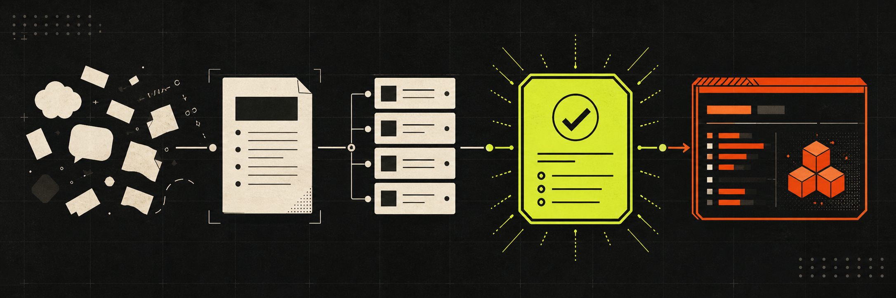
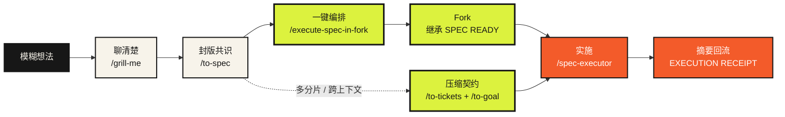

<p align="center">
  
</p>

<div align="center">

# Matt Skills with To-Goal

**把需求留在规划线程，把实现放进执行线程：能继承就 Fork，要搬运就 Goal**

让规划线程专注于把事情想清楚，让执行线程专注于把事情做完。

[](https://github.com/mattpocock/skills)
[](https://github.com/tt-a1i/matt-skills-with-to-goal)
[](#安装)
[](LICENSE)

`grill → spec ready → execute in fork → receipt returns`

[**▶ 在线故事版：别让一个线程从需求聊到代码写完**](https://verifiable-goal-weekly-share-public.pages.dev)

</div>

## 它解决什么问题

AI coding 任务常常从需求讨论一路聊到代码实现。线程越长，上下文越容易膨胀、压缩和变慢；但直接开新线程，又担心缺少需求背景和已经确认的决策。

这套技能把工作拆成两类线程，并用仓库里的持久化证据连接它们：

| 常见困境 | 这套流程的处理方式 |
|---|---|
| 方案讨论和代码实现挤在一个长线程里 | 规划线程停在 `SPEC READY`，fork 线程承担代码和测试日志 |
| Fork 后又重新分析和改写一遍 Goal | `spec-executor` 直接执行继承的最终 Spec，并回传结构化 receipt |
| Fork、启动和回传仍要手工串起来 | `execute-spec-in-fork` 自动创建执行任务、发送 Ask、接回结果并条件归档 |
| 当前上下文太脏、无法可靠继承 | `to-goal` 把 ticket 和仓库证据压成干净的执行契约 |
| 不同任务都使用同一档模型和推理强度 | goal 按风险推荐 Lightweight / Standard / Advanced 与推理强度 |
| “做完了”依赖人的主观判断 | Goal 带完成标准，executor 回传逐项证据和外部操作状态 |

> **Fork 负责隔离后续上下文，Goal 负责压缩已有上下文。** 连续开发优先 fork；跨人、跨天、跨引擎、并行或上下文混乱时使用 `to-goal`。

## 30 秒看懂主流程


```mermaid
flowchart LR
    idea["模糊想法"] --> grill["聊清楚<br/>/grill-me"]
    grill --> spec["封版共识<br/>/to-spec"]
    spec --> orchestrate["一键编排<br/>/execute-spec-in-fork"]
    orchestrate --> fork["Fork<br/>继承 SPEC READY"]
    fork --> execute["实施<br/>/spec-executor"]
    execute --> receipt["摘要回流<br/>EXECUTION RECEIPT"]
    spec -. "多分片 / 跨上下文" .-> goal["压缩契约<br/>/to-tickets + /to-goal"]
    goal --> execute

    classDef source fill:#171717,color:#F7F3EA,stroke:#171717,stroke-width:2px;
    classDef plan fill:#F7F3EA,color:#171717,stroke:#171717,stroke-width:2px;
    classDef contract fill:#DCF23E,color:#171717,stroke:#171717,stroke-width:3px;
    classDef action fill:#F35B2A,color:#FFFFFF,stroke:#171717,stroke-width:2px;

    class idea source;
    class grill,spec plan;
    class orchestrate,fork,goal contract;
    class execute,receipt action;
```

普通连续开发默认从最终 `SPEC READY` 处 fork。多分片、并行、延迟执行或上下文混乱时，再用 `to-tickets` / `to-goal` 建立可独立执行的合同。

## 三分钟开始

### 1. 安装

Claude Code 可以把本仓库作为独立 marketplace 安装：

```bash
claude plugin marketplace add tt-a1i/matt-skills-with-to-goal
claude plugin install matt-skills-with-to-goal@tt-a1i
```

Codex 和其他支持 Agent Skills 的工具使用 `skills.sh`：

```bash
npx skills@latest add tt-a1i/matt-skills-with-to-goal
```

两种方式选一种，避免同一个 Skill 被重复加载。本仓库维护者可运行 `npm run sync:local`，把工作树安全同步到统一的 `~/.agents_skills/` 并刷新 Hermes。

Codex App 中的自动 Fork 闭环还需要单独安装 [Codex Task Messenger](https://github.com/tt-a1i/codex-task-messenger)。其他 harness 仍可手动 Fork 后运行 `spec-executor`，不影响核心执行能力。

### 2. 初始化项目

每个项目首次使用时运行：

```text
/setup-matt-pocock-skills
```

[`setup-matt-pocock-skills`](./skills/engineering/setup-matt-pocock-skills/SKILL.md) 会确认三件事：issue tracker 在哪里、triage 标签如何映射、domain docs 如何组织。之后其他工程技能会读取这些约定。

### 3. 走一遍最短链路

```text
/grill-me
/to-spec
/execute-spec-in-fork
```

Codex App 会自动 Fork、启动 `/spec-executor`、回传 `SPEC EXECUTION RECEIPT`，并在验证完成后归档执行任务。若缺少原生任务工具，则手动 Fork 后运行 `/spec-executor`；若 Spec 无法在一个执行会话完成，则改走 `/to-tickets` → `/to-goal`。

## Fork 与 `to-goal` 如何分工

- **`execute-spec-in-fork` + `spec-executor`**：当前线程已经把需求谈清楚，Spec 能在一个执行会话完成；自动建立同目录执行任务和回传通道，避免重复查 Spec、重写 Goal 和手工复制 receipt。
- **`to-goal`**：需要跨人、跨天、跨引擎、并行，或者当前历史过长、存在多版冲突；用压缩后的执行合同换取干净上下文。
- **同线程 `/implement`**：小而明确、不值得建立持久 Spec 的改动。

自动 Fork 闭环拆成三层，每一层都可以单独复用：

| 层 | 负责 | 不负责 |
|---|---|---|
| 编排 · [`execute-spec-in-fork`](./skills/engineering/execute-spec-in-fork/SKILL.md) | 创建、命名、启动执行任务，校验 receipt，条件归档 | 写代码；替用户授权 commit / push / 部署 |
| 执行 · [`spec-executor`](./skills/engineering/spec-executor/SKILL.md) | 锁定 `SPEC READY`，实现、验证、评审，输出带证据的 receipt | 创建 Fork；在任务之间传话 |
| 通信 · [Codex Task Messenger](https://github.com/tt-a1i/codex-task-messenger) | 把 Ask / Reply / Resume 送到这次创建的准确任务 | 批准任何外部动作；消息不等于授权 |

没有 Codex App 任务工具或 Messenger 时，手动 Fork 后仍可运行 `spec-executor`。Executor 不绑死 Codex；Goal 更是一份可粘贴到 Cursor、Claude Code 或其他引擎的合同。

## `to-goal` 增加了什么

Matt 原版流程擅长把需求烤清楚、写成 spec、拆成 tickets。本仓库在 `to-tickets` 之后增加 `to-goal`，把“已经规划好的任务”进一步编译成“新线程可以直接执行的契约”。Goal 买的是可移植性：换会话、换人或换引擎之后，仍按同一份标准交付。

```text
Goal
├── Current state       分支、HEAD、已完成证据、已知缺口
├── Execution order     最短的依赖顺序
├── Completion criteria 可逐条判断 done / not done 的标准
├── Constraints         范围、权限、脏文件与外部操作边界
└── Context             spec、ticket、设计文档和验证入口
```

默认每个 frontier ticket 一份 Goal。互不阻塞的切片可以分别交给不同 Agent，在独立 branch / worktree 里并行；`to-goal` 只生成合同，不创建这些执行环境。

`goal-crafter` 有两种模式：

- **Standalone**：用户直接要求编写 goal，先澄清任务、位置、完成标准、约束和执行环境。
- **Compiled handoff**：由 `to-goal` 调用，直接读取已批准的 spec、ticket、评论和仓库状态，不重新访谈。

如果上游材料缺少关键产品决策，compiled-handoff 模式会指出 source 尚未 agent-ready，而不是在实现线程里重新开始需求讨论。

## 如何选择入口

| 你的情况 | 从这里开始 |
|---|---|
| 不确定该用哪个 skill | `/ask-matt` |
| 有一个想法，需要把需求问清楚 | `/grill-me` |
| 想边聊边沉淀文档 | `/grill-with-docs` |
| 工作很大，连路线都还不清楚 | `/wayfinder` |
| 已有共识，需要形成 spec | `/to-spec` |
| 已有最终 `SPEC READY`，要在 Codex Fork 中直接执行 | `/execute-spec-in-fork` |
| 已有 spec，需要拆成可执行切片 | `/to-tickets` |
| 已有 agent-ready ticket，要开新线程实现 | `/to-goal` |
| 关键在别人脑子里，需要问卷收集 | `/to-questionnaire` |
| 外部 issue / PR 需要评估和分流 | `/triage` |
| 正在定位复杂 bug | `/diagnosing-bugs` |
| 已完成一段实现，需要双轴评审 | `/code-review` |

## 技能地图

当前发行版包含 **29 个 promoted Skills**：25 个随上游同步的工程与生产力 Skill，以及本 fork 新增的 `to-goal`、`goal-crafter`、`spec-executor`、`execute-spec-in-fork`。

### 规划与交接

| Skill | 作用 |
|---|---|
| [`ask-matt`](./skills/engineering/ask-matt/SKILL.md) | 按当前情况选择入口 |
| [`grill-me`](./skills/productivity/grill-me/SKILL.md) / [`grilling`](./skills/productivity/grilling/SKILL.md) | 按轮次烤决策树 frontier，一轮多问直到共识 |
| [`grill-with-docs`](./skills/engineering/grill-with-docs/SKILL.md) | 访谈过程中同步沉淀文档 |
| [`wayfinder`](./skills/engineering/wayfinder/SKILL.md) | 为超大任务建立共享调查与决策地图 |
| [`to-spec`](./skills/engineering/to-spec/SKILL.md) | 当前对话 → agent-ready spec |
| [`to-tickets`](./skills/engineering/to-tickets/SKILL.md) | spec → 带依赖关系的 tracer-bullet tickets |
| [`to-goal`](./skills/engineering/to-goal/SKILL.md) | frontier ticket → 可粘贴的执行 goal |
| [`goal-crafter`](./skills/engineering/goal-crafter/SKILL.md) | 负责 goal 的可验证性与 harness 格式 |
| [`to-questionnaire`](./skills/productivity/to-questionnaire/SKILL.md) | 把答不上的决策编成问卷交给他人填写 |
| [`handoff`](./skills/productivity/handoff/SKILL.md) | 仅在关键上下文尚未沉淀到持久化载体时交接会话 |

### 实现与质量

| Skill | 作用 |
|---|---|
| [`implement`](./skills/engineering/implement/SKILL.md) | 按 spec 或 tickets 实现，驱动 `/tdd`，收尾跑 `/code-review` |
| [`execute-spec-in-fork`](./skills/engineering/execute-spec-in-fork/SKILL.md) | Codex App 中自动 Fork、启动 executor、处理决策回路、验证回传并归档 |
| [`spec-executor`](./skills/engineering/spec-executor/SKILL.md) | 在 fork 线程锁定 `SPEC READY`、权限和 fixed point，完成实现并输出 receipt |
| [`tdd`](./skills/engineering/tdd/SKILL.md) | 在预先确认的 seam 上进行测试驱动实现 |
| [`code-review`](./skills/engineering/code-review/SKILL.md) | Standards + Spec 双轴评审 |
| [`prototype`](./skills/engineering/prototype/SKILL.md) | 逻辑用可分享 HTML / UI 用变体探索，并保留为 primary source |
| [`research`](./skills/engineering/research/SKILL.md) | 使用高可信来源完成技术调研 |
| [`triage`](./skills/engineering/triage/SKILL.md) | 将外来 issue / PR 推进到明确状态 |

### 工程理解与其他

| Skill | 作用 |
|---|---|
| [`codebase-design`](./skills/engineering/codebase-design/SKILL.md) | 讨论和比较代码结构设计 |
| [`diagnosing-bugs`](./skills/engineering/diagnosing-bugs/SKILL.md) | 系统化定位复杂故障 |
| [`domain-modeling`](./skills/engineering/domain-modeling/SKILL.md) | 维护领域语言、CONTEXT 和 ADR |
| [`improve-codebase-architecture`](./skills/engineering/improve-codebase-architecture/SKILL.md) | 识别并推进架构深化机会 |
| [`resolving-merge-conflicts`](./skills/engineering/resolving-merge-conflicts/SKILL.md) | 处理合并冲突并保护双方意图 |
| [`teach`](./skills/productivity/teach/SKILL.md) | 多会话教学，目录作为有状态学习空间 |
| [`wizard`](./skills/engineering/wizard/SKILL.md) | 生成交互式 bash 向导，处理只有人能完成的步骤（开通基础设施、配置凭证 / CI secret） |
| [`wait-what`](./skills/productivity/wait-what/SKILL.md) | 对话中途没听懂时，让 agent 用 `CONTEXT.md` 词汇重新讲一遍 |
| [`writing-for-agents`](./skills/productivity/writing-for-agents/SKILL.md) | 编写给 agent 消费的文档（skills、AGENTS.md 等） |

## 设计边界

- 默认一个 goal 只覆盖一个 frontier ticket；`--all` 仅用于明确要求的跨 ticket 持久化执行。
- `spec-executor` 只执行一个已封版、单会话可完成的 Spec；需求未定或体量溢出时停止并重新路由。
- `execute-spec-in-fork` 是 Codex App 的事件驱动适配器，依赖原生任务工具与 Codex Task Messenger；不会启动 daemon、自动重试或跨 Worktree 通信。
- `to-goal` 只读 spec、tracker 和仓库证据，不实现、不改 issue 状态、不创建分支。
- Fork 只隔离对话，不隔离文件系统；并行实现仍需独立 worktree、分支和文件所有权。
- goal 不会默认授权 push、PR、merge、关闭 issue 或修改 tracker。
- 验证强度跟随任务风险；低风险改动不机械要求全量测试，高风险逻辑必须覆盖对应验证面。
- `handoff` 不是每次切线程的必选步骤。只要上下文已进入 spec、ticket、评论和代码，新线程可以直接重建理解。

## 来源与许可

本仓库基于 [mattpocock/skills](https://github.com/mattpocock/skills) **`main` v1.2.3（同步至 2026-08-10，`84fdeff`）**，并叠加自动 fork execution 与 to-goal 两条上下文边界流程。

当前 fork 发行版为 **`1.2.3-to-goal.1`**：前半段表示同步的上游版本，后缀表示本仓库自己的发行序列。Claude 插件、package metadata 和安装入口均使用独立身份 `matt-skills-with-to-goal`，不会覆盖上游的 `mattpocock-skills`。

- Matt 原版技能：© [Matt Pocock](https://github.com/mattpocock/skills)，MIT
- 本仓库扩展与适配：MIT
- 完整许可见 [`LICENSE`](LICENSE)

### 与上游的差异

- **新增 skill**：`to-goal`、`goal-crafter`、`spec-executor`、`execute-spec-in-fork`（均位于 `skills/engineering/`）
- **路由适配**：`ask-matt` 增加自动 `/execute-spec-in-fork`、手动 fork + `/spec-executor` 与 `/to-goal` 分支及「Crossing the context boundary」章节；`to-spec` 追加 `SPEC READY` launch block
- **表达层**：`grilling`、`to-tickets`、`triage`、`setup-matt-pocock-skills` 使用固定 emoji 锚点，便于扫读与按编号回复
- **独立发行**：package、Claude plugin、marketplace、changeset 和仓库链接使用本 fork 的名称、版本与远端
- **本地分发**：`npm run sync:local` 先备份并同步 29 个 promoted Skills 到统一的 `~/.agents_skills/`，再刷新 Hermes 副本
- **上游维护**：`npm run sync:upstream` 在干净工作树上创建备份分支，并把 fork overlay rebase 到最新 `upstream/main`；脚本不会自动 push
- **目录结构**：跟随上游 `skills/{engineering,productivity,misc,in-progress,deprecated}/` 分类
- **继承边界**：未被本 fork 修改的 Skill 和文档继续继承上游；发行元数据、维护脚本和本 fork 工作流由本仓库独立维护

完整的同步、备份和远端发布约定见 [`docs/maintaining-fork.md`](docs/maintaining-fork.md)。
